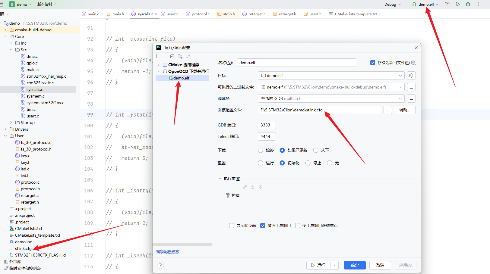

# CLion + STM32环境配置

首先感谢偶像稚晖君

稚晖君大神配置Clion的教程：https://zhuanlan.zhihu.com/p/145801160

我在进行配置的时候遇到了一些问题，以下是我的修改版本：

前面的的可以参照稚晖君大神的配置也可以不安装MinGW，直接使用**STM32CubeCLT**，这里面是STM官方给我们配置好的各种编译环境

> 可以不安装MinGW，直接使用**STM32CubeCLT**相对容易一些
>
> 可以不安装MinGW，直接使用**STM32CubeCLT**相对容易一些
>
> 可以不安装MinGW，直接使用**STM32CubeCLT**相对容易一些

## 我的环境

> **CLion 2024.1**
>
> **OpenOCD-20240916-0.12.0**
>
> **STM32CubeCLT_1.18.0**

## 相关资源在source文件夹内

GitHub上传大文件有点麻烦，给一个迅雷的下载链接：https://pan.xunlei.com/s/VOT6D5Qu-LTGNvuMcZoCLACRA1?pwd=iykg#
复制这段内容后打开迅雷，查看更方便


如果网盘下载的慢的话也可以直接去对应官网下载软件

**OpenOCD-20240916-0.12.0**版本的下载链接：https://www.st.com/en/development-tools/stm32cubeclt.html

**STM32CubeCLT_1.18.0**版本的下载链接：https://sysprogs.com/getfile/2285/openocd-20240916.7z

**Clion2024.1**版本的下载链接：https://download.jetbrains.com/cpp/CLion-2024.1.6.exe

**STM32CubeMX** 下载链接：https://www.st.com/en/development-tools/stm32cubemx.html

# 我的配置相设置如下

## 编译工具链


## Cmake


## 嵌入式开发设置


## 运行调试配置



# **编译错误问题**

1. 如果移动了工程文件夹的话，最好打开.ioc文件重新Generate一下再编译，可以解决很多错误。
2. 遇到任何CMake相关的报错，一般是由于缓存没有更新引起的，可以在CLion中选`Tools-CMake-Reset Cache and Reload Project`即可解决。

# **`printf`重定向问题**

**步骤一：**

在Keil里面为了使用`printf`函数我们需要重定向`fputc`函数：

```text
int fputc (int ch, FILE *f)
{
    (void)HAL_UART_Transmit(&huart1, (uint8_t *)&ch, 1, 1000);
    return ch;
}
```

其中的`FILE`定义在`stdio.h`头文件中，所以需要在项目中包含这个头文件，但是经过测试发现，Keil里面包含的是`MDK\ARM\ARMCC\include`这个目录下的`stdio.h`，而在Clion中是不会链接到这个文件的。因此如果在Clion中也按之前的方法进行重定向，会发现`printf`没有任何输出。

在Clion中链接的是`GNU-Tools-ARM-Embedded\arm-none-eabi\include`里面的`stdio.h`，如果仍然想使用`printf`函数功能，则需要进行如下操作：

新建一个`retarget.h`文件内容如下：

```text
#ifndef __RETARGET_H__
#define __RETARGET_H__

#include "main.h"
#include "usart.h"
#include <sys/stat.h>
#include <stdio.h>

void RetargetInit(UART_HandleTypeDef *huart);

int _isatty(int fd);

int _write(int fd, char *ptr, int len);

int _close(int fd);

int _lseek(int fd, int ptr, int dir);

int _read(int fd, char *ptr, int len);

int _fstat(int fd, struct stat *st);

#endif //#ifndef _RETARGET_H__
```

再新建一个`retarget.c`文件内容如下：

```text
#include <_ansi.h>
#include <_syslist.h>
#include <errno.h>
#include <sys/time.h>
#include <sys/times.h>
#include "retarget.h"
#include <stdint.h>

#if !defined(OS_USE_SEMIHOSTING)

#define STDIN_FILENO  0
#define STDOUT_FILENO 1
#define STDERR_FILENO 2

UART_HandleTypeDef *gHuart;

void RetargetInit(UART_HandleTypeDef *huart)
{
    gHuart = huart;

    /* Disable I/O buffering for STDOUT stream, so that
     * chars are sent out as soon as they are printed. */
    setvbuf(stdout, NULL, _IONBF, 0);
}

int _isatty(int fd)
{
    if (fd >= STDIN_FILENO && fd <= STDERR_FILENO)
        return 1;

    errno = EBADF;
    return 0;
}

int _write(int fd, char *ptr, int len)
{
    HAL_StatusTypeDef hstatus;

    if (fd == STDOUT_FILENO || fd == STDERR_FILENO)
    {
        hstatus = HAL_UART_Transmit(gHuart, (uint8_t *) ptr, len, HAL_MAX_DELAY);
        if (hstatus == HAL_OK)
            return len;
        else
            return EIO;
    }
    errno = EBADF;
    return -1;
}

int _close(int fd)
{
    if (fd >= STDIN_FILENO && fd <= STDERR_FILENO)
        return 0;

    errno = EBADF;
    return -1;
}

int _lseek(int fd, int ptr, int dir)
{
    (void) fd;
    (void) ptr;
    (void) dir;

    errno = EBADF;
    return -1;
}

int _read(int fd, char *ptr, int len)
{
    HAL_StatusTypeDef hstatus;

    if (fd == STDIN_FILENO)
    {
        hstatus = HAL_UART_Receive(gHuart, (uint8_t *) ptr, 1, HAL_MAX_DELAY);
        if (hstatus == HAL_OK)
            return 1;
        else
            return EIO;
    }
    errno = EBADF;
    return -1;
}

int _fstat(int fd, struct stat *st)
{
    if (fd >= STDIN_FILENO && fd <= STDERR_FILENO)
    {
        st->st_mode = S_IFCHR;
        return 0;
    }

    errno = EBADF;
    return 0;
}

#endif //#if !defined(OS_USE_SEMIHOSTING)
```

添加这两个文件到工程，更新CMake，**编译之后会发现，有几个系统函数重复定义了，被重复定义的函数位于`Src`目录的`syscalls.c`文件中**，我们把里面重复的几个函数删掉即可。

如图所示：


在main函数的初始化代码中添加对头文件的引用并注册重定向的串口号：

```text
#include "retarget.h"

RetargetInit(&huart1);
```

然后就可以愉快地使用`printf`和`scanf`啦：

```text
char buf[100];

printf("\r\nYour name: ");
scanf("%s", buf);
printf("\r\nHello, %s!\r\n", buf);
```

**步骤二：**

**上面的修改完成之后可能会发现无法正常读取浮点数，这里修改CMakeList.txt，加入下述编译选项**

```text
set(COMMON_FLAGS "-specs=nosys.specs -specs=nano.specs -u _printf_float -u _scanf_float")
```